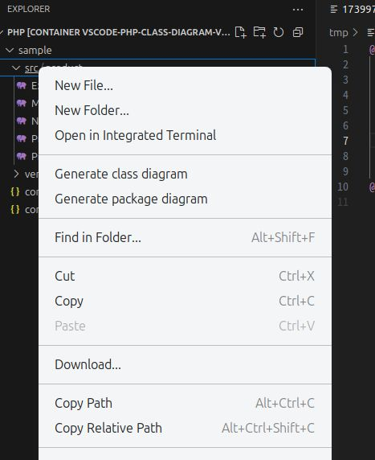

# php-class-diagram README

## Features

This VSCode extension allows you to generate and view class diagram scripts using [php-class-diagram](https://packagist.org/packages/smeghead/php-class-diagram) directly from the file explorer's folder context menu.

With this extension, you can:

* Execute the php-class-diagram CLI command from the context menu of a folder.

* Open the generated PlantUML class diagram script in VSCode.

* Use [the PlantUML extension](https://marketplace.visualstudio.com/items?itemName=jebbs.plantuml) to visualize the class diagram.




## Requirements

Before using this extension, ensure the following requirements are met:

* PHP 8 or later must be installed and available in your system.

* php-class-diagram must be installed in the project folder via Composer:

```bash
composer require --dev smeghead/php-class-diagram
```


## Extension Settings

- `php-class-diagram.executablePath`: Specify the path to the php-class-diagram executable.

## Known Issues

There is no known issues.
